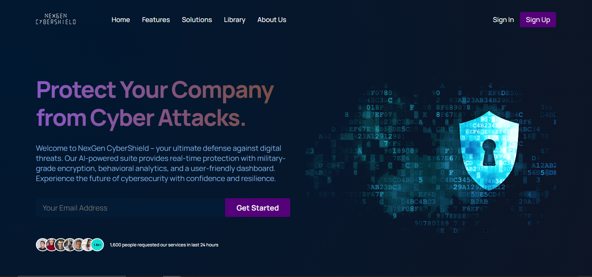

# NexGen CyberShield
Welcome to the NexGen CyberShield Showcase, a static website project developed with React.js to highlight my front-end development skills.

## Live Demo

Explore the live demo [here](https://nexgen-cybershield.surge.sh/ "Live Demo" target="_blank").

## Technologies Used
- React.js
- HTML5
- CSS3
- Node.js

## Features
- Clean and modern design
- Responsive layout for seamless viewing on various devices
- Integration of React.js for dynamic and interactive user experiences

Feel free to explore the website and navigate through its pages to get a glimpse of the cybersecurity solutions offered by NexGen CyberShield. If you have any feedback or questions, don't hesitate to [contact me](mailto:shabdulmoiz96@gmail.com).

## How to Run Locally
1. Clone this repository: `git clone https://github.com/AbdulMoiz961/Static-NexGen_Cybershield.git`
2. Navigate to the project directory: `cd Static-NexGen_Cybershield`
3. Install dependencies: `npm install`
4. Start the development server: `npm start`

---

Happy Coding! 🚀
